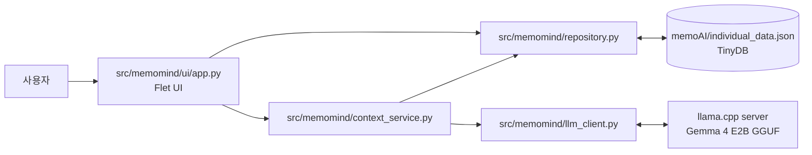
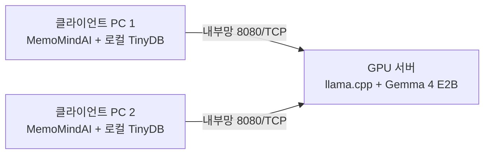

# MemoMindAI

> 끄적임은 자유롭게, 정리는 AI가

MemoMindAI는 개인 또는 조직의 업무 메모를 구조화하고, 로컬·내부망 LLM에 자연어로 질문할 수 있는 Flet 기반 업무지식·인수인계 도구입니다.

메모는 TinyDB에 저장되며, AI 추론은 `llama.cpp`의 OpenAI 호환 API를 사용합니다.

<p align="center">
  
</p>

## 주요 기능

- 프로젝트·업무유형별 메모 등록, 검색, 수정, 삭제
- 질문에 맞는 업무유형을 AI가 자동 분류하고 관련 메모를 근거로 답변
- 답변 스트리밍, 대화 초기화, 라이트·다크 모드
- 업무유형별 또는 전체 메모를 JSON으로 추출
- 전달받은 JSON을 중복 확인 후 등록하는 인수인계 기능
- 로컬 노트북 단독 실행과 내부 GPU 서버–클라이언트 분리 실행 지원

| 메모 등록·수정                                                  | 메모 추출·인수인계                                      |
| ---------------------------------------------------------------- | -------------------------------------------------------- |
|  |  |

[전체 시연 영상 보기](docs/videos/MemoMind_main.mp4) · [프로젝트 결과 보고서 보기](MemoMind_report.html)

## 동작 구조



기능별 파일 구조와 변경 지침은 [리팩토링 구조 문서](docs/ARCHITECTURE.md)를 참고하세요. 최상위 `MemoMindAI.py`는 기존 실행 명령을 유지하기 위한 진입점이며 실제 애플리케이션 코드는 `src/memomind`에 있습니다.

`MemoMindAI.py`의 기본 API 주소와 모델 이름은 다음과 같습니다.

```text
LLAMACPP_API_URL=http://127.0.0.1:8080/v1/chat/completions
MODEL_NAME=gemma-4-e2b-it
```

두 값은 환경변수로 변경할 수 있습니다.

## 준비 사항

- Python 3.10 이상
- 모델 저장 공간: Q4_0 기준 약 2.84GB 이상
- 메모리: 모델 파일 크기보다 여유 있게 준비 권장
- 최초 `-hf` 실행 시 모델을 받을 수 있는 인터넷 연결

Apple Silicon Mac은 Metal 가속을 사용할 수 있습니다. Windows·Linux의 NVIDIA GPU 가속은 CUDA 지원 빌드가 필요합니다. GPU가 없어도 CPU로 실행할 수 있지만 응답 속도가 느릴 수 있습니다.

## 1. llama.cpp 설치

공식 설치 안내: [llama.cpp 사전 빌드 설치](https://github.com/ggml-org/llama.cpp/blob/master/docs/install.md) · [릴리스 파일](https://github.com/ggml-org/llama.cpp/releases)

### Windows 10/11

PowerShell을 열고 WinGet으로 설치합니다.

```powershell
winget install llama.cpp
```

PowerShell을 새로 연 뒤 설치를 확인합니다.

```powershell
llama-server.exe --version
```

최신 배포판에서 통합 실행 파일만 제공되는 경우에는 다음 명령으로 확인합니다.

```powershell
llama version
```

WinGet을 사용할 수 없다면 [llama.cpp Releases](https://github.com/ggml-org/llama.cpp/releases)에서 Windows용 ZIP을 내려받아 압축을 풀고, `llama-server.exe`가 있는 폴더에서 명령을 실행하거나 해당 폴더를 `PATH`에 추가합니다.

### macOS(MacBook)

[Homebrew](https://brew.sh/)가 설치되어 있다면 다음과 같이 설치합니다.

```bash
brew install llama.cpp
llama-server --version
```

Apple Silicon에서는 공식 빌드의 Metal 가속이 기본으로 활성화됩니다. 최신 배포판에서 통합 실행 파일만 제공되면 `llama version`으로 확인합니다.

### Linux 서버(NVIDIA GPU 권장)

CUDA Toolkit과 C++ 빌드 도구를 준비한 뒤 CUDA 지원 버전을 빌드합니다. 먼저 `nvidia-smi`와 `nvcc --version`이 정상 동작하는지 확인하세요.

```bash
sudo apt update
sudo apt install -y git cmake build-essential libcurl4-openssl-dev
git clone https://github.com/ggml-org/llama.cpp.git
cd llama.cpp
cmake -B build -DGGML_CUDA=ON -DCMAKE_BUILD_TYPE=Release
cmake --build build --config Release -j --target llama-server
./build/bin/llama-server --version
```

CPU 전용 서버라면 `cmake -B build -DCMAKE_BUILD_TYPE=Release`로 구성합니다. 자세한 옵션은 [공식 빌드 가이드](https://github.com/ggml-org/llama.cpp/blob/master/docs/build.md)를 참고하세요.

## 2. Gemma 4 E2B GGUF 모델 다운로드

모델 저장소: [`ggml-org/gemma-4-E2B-it-GGUF`](https://huggingface.co/ggml-org/gemma-4-E2B-it-GGUF)

이 저장소는 BF16, Q8_0, Q4_0 파일을 제공합니다. 노트북에서는 용량과 속도를 고려해 `Q4_0`을 기본으로 권장합니다.

| 양자화 | 모델 파일 크기 | 용도                        |
| ------ | -------------: | --------------------------- |
| Q4_0   |      약 2.84GB | 노트북·저사양 장비 권장    |
| Q8_0   |      약 4.97GB | 품질 우선, 메모리 여유 필요 |
| BF16   |      약 9.31GB | 고성능 서버, 큰 메모리 필요 |

### 방법 A — llama.cpp가 자동 다운로드

가장 간단한 방법입니다. 아래 서버 실행 명령을 처음 실행하면 Q4_0 모델이 Hugging Face 캐시에 자동 저장됩니다.

```bash
llama-server -hf ggml-org/gemma-4-E2B-it-GGUF:Q4_0 \
  --alias gemma-4-e2b-it \
  --host 127.0.0.1 --port 8080 \
  --no-mmproj --reasoning off \
  -c 32768 -np 1
```

Windows PowerShell에서는 다음과 같이 실행합니다.

```powershell
llama-server.exe -hf ggml-org/gemma-4-E2B-it-GGUF:Q4_0 `
  --alias gemma-4-e2b-it `
  --host 127.0.0.1 --port 8080 `
  --no-mmproj --reasoning off `
  -c 32768 -np 1
```

이 앱은 텍스트만 사용하므로 `--no-mmproj`로 이미지용 projector의 추가 다운로드를 생략합니다.

모델 추론 단계를 답변에 노출하지 않도록 `--reasoning off`도 적용합니다.

통합 실행 파일을 사용하는 최신 배포판에서는 위 명령의 `llama-server`를 다음과 같이 바꿀 수 있습니다.

```bash
llama serve -hf ggml-org/gemma-4-E2B-it-GGUF:Q4_0 \
  --alias gemma-4-e2b-it --host 127.0.0.1 --port 8080 \
  --no-mmproj --reasoning off \
  -c 32768 -np 1
```

### 방법 B — GGUF 파일을 지정 폴더에 직접 다운로드

[Hugging Face CLI](https://huggingface.co/docs/huggingface_hub/en/guides/cli)를 설치한 뒤 Q4_0 파일을 프로젝트의 `models` 폴더로 받습니다.

```bash
python -m pip install -U huggingface_hub
hf download ggml-org/gemma-4-E2B-it-GGUF \
  gemma-4-E2B-it-Q4_0.gguf \
  --local-dir models
```

Windows PowerShell에서도 같은 명령을 한 줄로 실행할 수 있습니다.

```powershell
python -m pip install -U huggingface_hub
hf download ggml-org/gemma-4-E2B-it-GGUF gemma-4-E2B-it-Q4_0.gguf --local-dir models
```

다운로드한 파일로 서버를 실행합니다.

```bash
llama-server -m models/gemma-4-E2B-it-Q4_0.gguf \
  --alias gemma-4-e2b-it \
  --host 127.0.0.1 --port 8080 \
  --reasoning off \
  -c 32768 -np 1
```

Windows에서는 모델 경로를 `models\gemma-4-E2B-it-Q4_0.gguf`로 지정합니다.

## 3. MemoMindAI 설치

저장소를 받은 뒤 프로젝트 폴더에서 진행합니다.

### Windows PowerShell

```powershell
py -3 -m venv .venv
Set-ExecutionPolicy -Scope Process Bypass
.\.venv\Scripts\Activate.ps1
python -m pip install --upgrade pip
pip install -r requirements.txt
```

### macOS·Linux

```bash
python3 -m venv .venv
source .venv/bin/activate
python -m pip install --upgrade pip
pip install -r requirements.txt
```

## 4. 노트북에서 모델과 서비스 실행

모델 서버와 MemoMindAI 앱을 서로 다른 터미널에서 실행합니다.

### 터미널 1 — 모델 서버

macOS·Linux:

```bash
llama-server -hf ggml-org/gemma-4-E2B-it-GGUF:Q4_0 \
  --alias gemma-4-e2b-it \
  --host 127.0.0.1 --port 8080 \
  --no-mmproj --reasoning off \
  -c 32768 -np 1
```

Windows PowerShell:

```powershell
llama-server.exe -hf ggml-org/gemma-4-E2B-it-GGUF:Q4_0 `
  --alias gemma-4-e2b-it `
  --host 127.0.0.1 --port 8080 `
  --no-mmproj --reasoning off `
  -c 32768 -np 1
```

서버가 준비되었는지 확인합니다.

```bash
curl http://127.0.0.1:8080/health
```

`{"status":"ok"}`가 표시되면 준비가 끝난 것입니다. 모델 로딩 중에는 일시적으로 HTTP 503이 반환될 수 있습니다.

### 터미널 2 — MemoMindAI 앱

가상환경을 활성화한 프로젝트 폴더에서 실행합니다.

```bash
python MemoMindAI.py
```

앱은 기본적으로 로컬의 `127.0.0.1:8080` 서버에 연결하므로 별도 설정이 필요하지 않습니다.

## 5. 서버에서 모델 구동, 클라이언트에서 앱 실행

### 구성



### 5-1. 서버에서 모델 API 시작

`<내부망_IP>`는 예를 들어 `192.168.0.20`과 같은 실제 서버 주소입니다. `--host 0.0.0.0`은 모든 인터페이스에서 요청을 받으므로 인터넷에 직접 노출하지 마세요.

서버에 설치된 `llama-server`를 다음과 같이 실행합니다.

```bash
llama-server -hf ggml-org/gemma-4-E2B-it-GGUF \
  --reasoning off \
  --host 0.0.0.0 \
  --no-mmproj \
  -c 32768 \
  -np 1
```

소스에서 직접 빌드했다면 `llama-server` 대신 `./build/bin/llama-server`를 사용합니다. 특정 NVIDIA GPU만 사용하려면 명령 앞에 `CUDA_VISIBLE_DEVICES=0`을 붙이고, 필요하면 `--n-gpu-layers all`을 추가합니다.

- `-c 32768`은 모델의 컨텍스트 크기를 32,768토큰으로 설정합니다.
- `-np 1`은 서버의 요청 처리 슬롯을 1개로 설정합니다.

컨텍스트 크기를 늘리면 KV 캐시가 사용하는 메모리도 증가합니다. 메모리가 부족하면 `-c` 값을 낮추고, 동시 요청이 필요하면 서버 자원을 확인한 뒤 `-np` 값을 조정하세요. 서버 방화벽에서는 신뢰하는 내부망 또는 클라이언트 IP만 8080/TCP에 접근하도록 제한해야 합니다.

다른 PC에서 연결 여부를 확인합니다.

```bash
curl http://<내부망_IP>:8080/health
```

### 5-2. 클라이언트에서 MemoMindAI 시작

클라이언트에는 모델이나 llama.cpp가 필요하지 않고 Python 앱 의존성만 설치하면 됩니다.

macOS·Linux:

```bash
export LLAMACPP_API_URL="http://<내부망_IP>:8080/v1/chat/completions"
export MODEL_NAME="gemma-4-e2b-it"
python MemoMindAI.py
```

Windows PowerShell:

```powershell
$env:LLAMACPP_API_URL="http://<내부망_IP>:8080/v1/chat/completions"
$env:MODEL_NAME="gemma-4-e2b-it"
python .\MemoMindAI.py
```

환경변수는 현재 터미널에만 적용됩니다. 앱을 다시 실행할 때 같은 터미널을 사용하거나 환경변수를 다시 지정하세요.

### 선택 사항 — 여러 GPU에 독립 인스턴스 배치

보고서에서 검증한 방식처럼 GPU마다 모델 인스턴스를 하나씩 배치할 수 있습니다. 아래는 4개 GPU를 각각 8081~8084 포트에 할당하는 예시입니다.

```bash
CUDA_VISIBLE_DEVICES=0 ./build/bin/llama-server -hf ggml-org/gemma-4-E2B-it-GGUF:Q4_0 --alias gemma-4-e2b-it --host 127.0.0.1 --port 8081 --n-gpu-layers all --no-mmproj --reasoning off -c 32768 -np 1
CUDA_VISIBLE_DEVICES=1 ./build/bin/llama-server -hf ggml-org/gemma-4-E2B-it-GGUF:Q4_0 --alias gemma-4-e2b-it --host 127.0.0.1 --port 8082 --n-gpu-layers all --no-mmproj --reasoning off -c 32768 -np 1
CUDA_VISIBLE_DEVICES=2 ./build/bin/llama-server -hf ggml-org/gemma-4-E2B-it-GGUF:Q4_0 --alias gemma-4-e2b-it --host 127.0.0.1 --port 8083 --n-gpu-layers all --no-mmproj --reasoning off -c 32768 -np 1
CUDA_VISIBLE_DEVICES=3 ./build/bin/llama-server -hf ggml-org/gemma-4-E2B-it-GGUF:Q4_0 --alias gemma-4-e2b-it --host 127.0.0.1 --port 8084 --n-gpu-layers all --no-mmproj --reasoning off -c 32768 -np 1
```

Nginx 등 내부 리버스 프록시에서 이 인스턴스들을 분산하고, 클라이언트의 `LLAMACPP_API_URL`은 프록시 주소로 지정합니다. SSE 스트리밍을 사용하므로 프록시 버퍼링을 끄고 읽기 제한시간을 충분히 길게 설정해야 합니다.

## 사용 방법

1. **업무메모 관리**에서 프로젝트명과 메모 내용을 입력해 저장합니다.
2. 메인 채팅에서 `프로젝트명 + 질문` 형식으로 질문합니다.
3. AI가 등록된 업무유형을 분류하고 관련 메모를 찾아 답변합니다.
4. **인수인계** 메뉴에서 선택 업무 또는 전체 메모를 JSON으로 추출합니다.
5. 후임자는 **받은 메모 등록**에서 전달받은 JSON 파일을 불러옵니다.

메모 DB는 실행 파일과 같은 위치의 `memoAI/individual_data.json`에 생성됩니다. 이 파일에는 실제 업무 내용이 들어가므로 GitHub에 커밋하지 말고 별도로 백업·보호하세요.

## 환경변수

| 변수                 | 기본값                                        | 설명                                                       |
| -------------------- | --------------------------------------------- | ---------------------------------------------------------- |
| `LLAMACPP_API_URL` | `http://127.0.0.1:8080/v1/chat/completions` | llama.cpp OpenAI 호환 채팅 API 주소                        |
| `MODEL_NAME`       | `gemma-4-e2b-it`                            | API 요청에 전달할 모델 이름. 서버의`--alias`와 일치 권장 |

## 문제 해결

### `llama-server` 명령을 찾을 수 없음

- 터미널을 새로 열고 다시 확인합니다.
- Windows ZIP 설치는 `llama-server.exe` 폴더에서 실행하거나 해당 경로를 `PATH`에 추가합니다.
- 통합 CLI 배포판이면 `llama serve ...` 형식을 사용합니다.

### 앱에 “인공지능 서버에 연결되지 않았습니다”가 표시됨

- `curl http://<서버주소>:8080/health`로 서버 상태를 확인합니다.
- `LLAMACPP_API_URL`에 `/v1/chat/completions`까지 포함했는지 확인합니다.
- 원격 구성에서는 서버 방화벽, IP, 포트, 클라이언트와 서버의 네트워크 연결을 확인합니다.

### 모델 로딩 중 메모리 부족

- BF16이나 Q8_0 대신 Q4_0을 사용합니다.
- `-c` 값을 낮춰 KV 캐시 메모리 사용량을 줄입니다.
- 여러 슬롯을 사용 중이라면 `-np` 값을 낮춥니다.
- GPU 메모리가 부족하면 `--n-gpu-layers` 값을 낮춰 일부 레이어를 CPU에 배치합니다.

### `--reasoning` 또는 다른 옵션을 인식하지 못함

llama.cpp 버전이 오래된 경우입니다. WinGet/Homebrew 패키지를 업데이트하거나 최신 릴리스로 다시 빌드하세요.

## 보안 및 운영 주의사항

- 로컬 단독 실행은 `--host 127.0.0.1`을 유지하세요.
- 원격 서버는 공인 인터넷에 직접 노출하지 말고 내부망·VPN·방화벽·TLS 리버스 프록시를 사용하세요.
- 서버형 구성에서는 선택된 메모 내용이 질문과 함께 모델 서버로 전송됩니다. 기관의 개인정보·행정정보 보호 기준에 맞는 서버와 네트워크를 사용하세요.
- 현재 앱은 llama.cpp API 키 헤더를 전송하지 않습니다. API 인증이 필요하면 인증 리버스 프록시 또는 클라이언트 코드 보완이 필요합니다.
- AI 답변은 등록 메모를 근거로 하지만 오류가 있을 수 있으므로 중요한 행정 판단에는 원문 확인 절차를 두세요.

## 참고 자료

- [llama.cpp 공식 저장소](https://github.com/ggml-org/llama.cpp)
- [llama.cpp 설치 안내](https://github.com/ggml-org/llama.cpp/blob/master/docs/install.md)
- [llama.cpp 빌드 안내](https://github.com/ggml-org/llama.cpp/blob/master/docs/build.md)
- [llama.cpp HTTP 서버 안내](https://github.com/ggml-org/llama.cpp/blob/master/tools/server/README.md)
- [Gemma 4 E2B IT GGUF 모델](https://huggingface.co/ggml-org/gemma-4-E2B-it-GGUF)
- [Hugging Face CLI 다운로드 안내](https://huggingface.co/docs/huggingface_hub/en/guides/cli)
