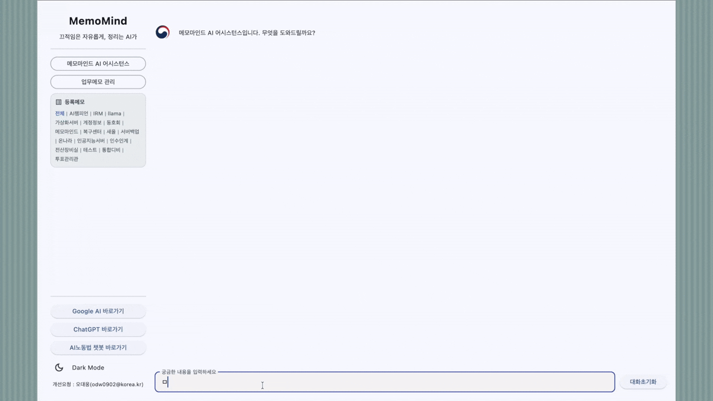
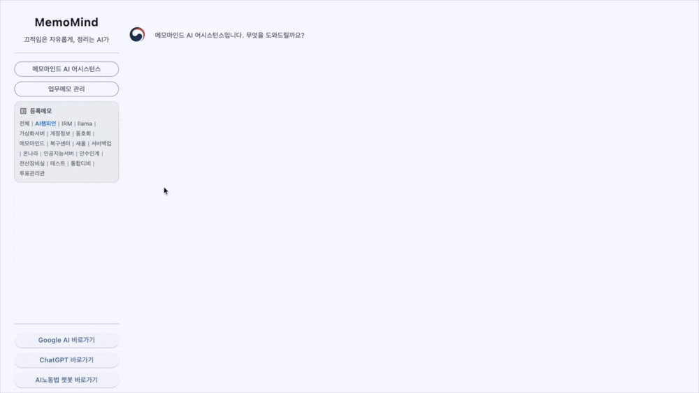
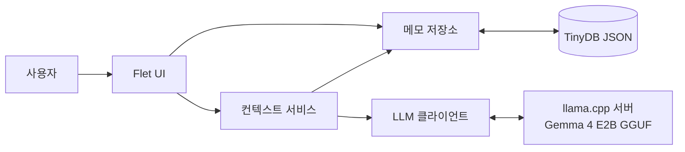
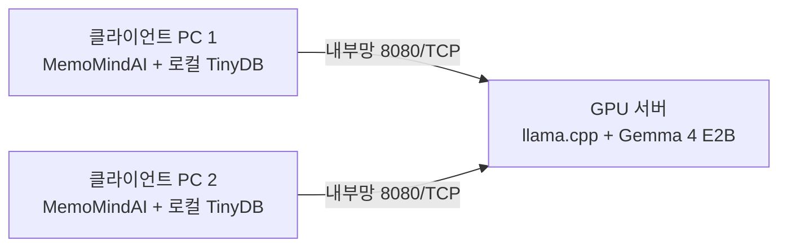

# MemoMindAI

> 끄적임은 자유롭게, 정리는 AI가
>
> 개인과 기업의 내부 정보를 외부 AI 서비스에 보내지 않고, 내가 통제하는 로컬·내부망 AI로 활용할 수 있습니다.

## 1. 소개

MemoMindAI는 업무 메모를 구조화하여 저장하고, 로컬 LLM에 자연어로 질문할 수 있는 업무지식·인수인계 도구입니다.

등록한 메모는 JSON 형식으로 저장되며, 앱은 질문과 관련된 메모를 찾아 RAG(검색 증강 생성) 방식으로 답변합니다.

개인 메모와 기업 내부문서를 공개형 클라우드 AI에 업로드할 필요가 없습니다. 노트북 단독 구성에서는 메모 저장부터 AI 추론까지 사용자 PC 안에서 처리하고, 서버·클라이언트 구성에서는 선택된 메모와 질문을 사용자가 지정한 내부망 모델 서버로만 전송합니다. 따라서 조직이 관리하는 장비와 네트워크 안에서 민감한 업무지식을 AI로 검색하고 활용할 수 있습니다.

> [!IMPORTANT]
> 데이터 보호 범위는 `LLAMACPP_API_URL`에 지정한 모델 서버와 네트워크 구성에 따라 달라집니다. 외부 서버 주소를 지정하거나 내부 API를 공인 인터넷에 노출하면 정보가 통제 범위를 벗어날 수 있으므로, 내부망·VPN·방화벽 등 조직의 보안 정책을 함께 적용해야 합니다.

<p align="center">
  
</p>

### 무엇을 할 수 있나요?

- 업무유형별 메모 등록, 검색, 수정, 삭제
- 질문에 맞는 업무유형 자동 분류 및 관련 메모 기반 답변
- 답변 스트리밍, 대화 초기화, 라이트·다크 모드
- 업무유형별 또는 전체 메모를 JSON으로 추출
- 전달받은 JSON의 중복을 확인한 뒤 등록하는 인수인계
- 개발자 노트북 단독 실행과 내부 서버–클라이언트 분리 실행

| 메모 등록·수정                                                  | 메모 추출·인수인계                                      |
| ---------------------------------------------------------------- | -------------------------------------------------------- |
|  |  |

### 어떤 설치 방법을 선택해야 하나요?

| 목적                                          | 읽을 부분                                                           |
| --------------------------------------------- | ------------------------------------------------------------------- |
| 노트북 한 대에서 모델과 앱을 함께 개발·실행  | [2. 개발자 노트북에 설치하는 방법](#2-개발자-노트북에-설치하는-방법) |
| GPU 서버에서 모델을 실행하고 PC에서 앱만 사용 | [3. 서버·클라이언트 설치 방법](#3-서버클라이언트-설치-방법)         |
| Windows 실행 파일 또는 macOS 앱 제작          | [4. 배포용 프로그램 빌드 방법](#4-배포용-프로그램-빌드-방법)         |

### 동작 구조



최상위 `MemoMindAI.py`는 프로그램 진입점이고, 실제 애플리케이션 코드는 `src/memomind`에 있습니다. 파일별 역할은 [아키텍처 문서](src/ARCHITECTURE.md)를 참고하세요.

코드를 수정할 때는 원하는 기능에 따라 다음 파일부터 확인하면 됩니다.

| 아키텍처 구분                          | 개발 파일                          |
| -------------------------------------- | ----------------------------------- |
| 화면 구성, 버튼, 다이얼로그            | `src/memomind/ui/app.py`          |
| API 주소, 모델 이름, 데이터·에셋 경로 | `src/memomind/config.py`          |
| 메모 저장·검색·수정·삭제            | `src/memomind/repository.py`      |
| 질문 분류와 검색 컨텍스트 생성         | `src/memomind/context_service.py` |
| llama.cpp 요청과 스트리밍 응답         | `src/memomind/llm_client.py`      |
| JSON 추출과 인수인계                   | `src/memomind/handover.py`        |

### 기본 사용 방법

1. **업무메모 관리**에서 프로젝트명과 메모 내용을 입력해 저장합니다.
2. 메인 채팅에서 `프로젝트명 + 질문` 형식으로 질문합니다.
3. AI가 업무유형을 분류하고 관련 메모를 찾아 답변합니다.
4. **인수인계** 메뉴에서 선택 업무 또는 전체 메모를 JSON으로 추출합니다.
5. 후임자는 **받은 메모 등록**에서 전달받은 JSON 파일을 불러옵니다.

소스 코드로 실행할 때 메모는 프로젝트의 `memoAI/individual_data.json`에 저장됩니다. 이 파일에는 실제 업무 내용이 들어가므로 GitHub에 커밋하지 말고 별도로 백업·보호하세요.

## 2. 개발자 노트북에 설치하는 방법

이 구성은 노트북 한 대에서 `llama.cpp` 모델 서버와 MemoMindAI 앱을 함께 실행합니다. 모델 서버와 앱은 각각 별도의 터미널에서 실행해야 합니다.

### 2-1. 준비 사항

- Python 3.10 이상
- Q4_0 모델 기준 약 2.84GB 이상의 저장 공간
- 모델 파일보다 여유 있는 메모리
- 최초 모델 다운로드를 위한 인터넷 연결

Apple Silicon Mac은 Metal 가속을 사용할 수 있습니다. Windows·Linux에서 NVIDIA GPU를 사용하려면 CUDA 지원 `llama.cpp` 빌드가 필요합니다. GPU가 없어도 CPU로 실행할 수 있지만 응답 속도가 느릴 수 있습니다.

### 2-2. Python 환경과 앱 의존성 설치

저장소를 내려받거나 복사한 뒤 프로젝트 루트에서 실행합니다.

Windows PowerShell:

```powershell
py -3 -m venv .venv
Set-ExecutionPolicy -Scope Process Bypass
.\.venv\Scripts\Activate.ps1
python -m pip install --upgrade pip
pip install -r requirements.txt
```

macOS·Linux:

```bash
python3 -m venv .venv
source .venv/bin/activate
python -m pip install --upgrade pip
pip install -r requirements.txt
```

### 2-3. llama.cpp 설치

Windows PowerShell:

```powershell
winget install llama.cpp
llama-server.exe --version
```

WinGet을 사용할 수 없다면 [llama.cpp Releases](https://github.com/ggml-org/llama.cpp/releases)에서 Windows용 ZIP을 내려받아 압축을 풀고, `llama-server.exe` 폴더를 `PATH`에 추가합니다.

macOS:

```bash
brew install llama.cpp
llama-server --version
```

Apple Silicon용 공식 빌드는 Metal 가속이 기본으로 활성화됩니다. 최신 배포판에서 `llama-server` 대신 통합 CLI만 제공되면 `llama version`으로 설치를 확인하고 이후 명령의 `llama-server`를 `llama serve`로 바꿉니다.

### 2-4. 모델 서버 실행

가장 간단한 방법은 `-hf` 옵션으로 Q4_0 모델을 자동 다운로드하는 것입니다. 처음 실행할 때 모델이 Hugging Face 캐시에 저장됩니다.

macOS·Linux:

```bash
llama-server -hf ggml-org/gemma-4-E2B-it-GGUF:Q4_0 \
  --alias gemma-4-e2b-it \
  --host 127.0.0.1 --port 8080 \
  --no-mmproj --reasoning off \
  -c 32768 -np 1
```

Windows PowerShell:

```powershell
llama-server.exe -hf ggml-org/gemma-4-E2B-it-GGUF:Q4_0 `
  --alias gemma-4-e2b-it `
  --host 127.0.0.1 --port 8080 `
  --no-mmproj --reasoning off `
  -c 32768 -np 1
```

MemoMindAI는 텍스트만 사용하므로 `--no-mmproj`로 이미지용 projector 다운로드를 생략합니다.`--reasoning off`는 모델의 추론 단계를 답변에 노출하지 않도록 설정합니다.

다른 터미널에서 서버 상태를 확인합니다.

```bash
curl http://127.0.0.1:8080/health
```

`{"status":"ok"}`가 표시되면 준비가 끝난 것입니다. 모델 로딩 중에는 일시적으로 HTTP 503이 반환될 수 있습니다.

### 2-5. MemoMindAI 실행

모델 서버를 그대로 둔 상태에서 두 번째 터미널을 열고 가상환경을 활성화합니다.

```bash
python MemoMindAI.py
```

앱은 기본적으로 `http://127.0.0.1:8080/v1/chat/completions`에 연결하고 `gemma-4-e2b-it` 모델 이름을 사용합니다.

### 2-6. 로컬 실행 문제 해결

`llama-server` 명령을 찾을 수 없는 경우:

- 설치 후 터미널을 새로 엽니다.
- Windows ZIP 설치는 `llama-server.exe` 폴더에서 실행하거나 해당 폴더를 `PATH`에 추가합니다.
- 통합 CLI 배포판이면 `llama serve ...` 형식을 사용합니다.

모델 로딩 중 메모리가 부족한 경우:

- BF16이나 Q8_0 대신 Q4_0 모델을 사용합니다.
- `-c` 값을 낮춰 KV 캐시 메모리 사용량을 줄입니다.
- 여러 슬롯을 사용한다면 `-np` 값을 낮춥니다.
- GPU 메모리가 부족하면 `--n-gpu-layers` 값을 낮춰 일부 레이어를 CPU에 배치합니다.

`--reasoning` 옵션을 인식하지 못하면 `llama.cpp` 버전이 오래된 것입니다. WinGet·Homebrew 패키지를 업데이트하거나 최신 릴리스로 다시 설치하세요.

## 3. 서버·클라이언트 설치 방법

이 구성은 GPU 서버에서 모델 API를 실행하고, 사용자 PC에서는 MemoMindAI와 로컬 메모 DB만 실행합니다. 클라이언트에는 모델 파일이나 `llama.cpp`가 필요하지 않습니다.



### 3-1. 서버에 llama.cpp 설치

아래는 Ubuntu와 NVIDIA GPU를 기준으로 한 예시입니다. 먼저 `nvidia-smi`와 `nvcc --version`이 정상 동작하는지 확인합니다.

```bash
sudo apt update
sudo apt install -y git cmake build-essential libcurl4-openssl-dev
git clone https://github.com/ggml-org/llama.cpp.git
cd llama.cpp
cmake -B build -DGGML_CUDA=ON -DCMAKE_BUILD_TYPE=Release
cmake --build build --config Release -j --target llama-server
./build/bin/llama-server --version
```

CPU 전용 서버라면 CMake 구성 명령에서 `-DGGML_CUDA=ON`을 제외합니다.

### 3-2. 서버에서 모델 API 실행

`<내부망_IP>`는 `192.168.0.20`과 같은 실제 서버 주소입니다. 아래 명령은 모든 서버 네트워크 인터페이스의 8080 포트에서 API 요청을 받습니다.

```bash
./build/bin/llama-server \
  -hf ggml-org/gemma-4-E2B-it-GGUF:Q4_0 \
  --alias gemma-4-e2b-it \
  --host 0.0.0.0 --port 8080 \
  --n-gpu-layers all \
  --no-mmproj --reasoning off \
  -c 32768 -np 1
```

- `--n-gpu-layers all`: 가능한 모델 레이어를 GPU에 배치합니다.
- `-c 32768`: 모델의 컨텍스트 크기를 32,768토큰으로 설정합니다.
- `-np 1`: 요청 처리 슬롯을 1개로 설정합니다.

컨텍스트 크기와 슬롯 수를 늘리면 메모리 사용량도 증가합니다. 서버 자원에 맞게 `-c`와 `-np` 값을 조정하세요.

클라이언트 PC에서 연결 상태를 확인합니다.

```bash
curl http://<내부망_IP>:8080/health
```

### 3-3. 클라이언트에 MemoMindAI 설치

클라이언트 PC에 프로젝트를 내려받거나 복사한 뒤 Python 가상환경과 앱 의존성만 설치합니다.

Windows PowerShell:

```powershell
py -3 -m venv .venv
Set-ExecutionPolicy -Scope Process Bypass
.\.venv\Scripts\Activate.ps1
python -m pip install --upgrade pip
pip install -r requirements.txt
```

macOS·Linux:

```bash
python3 -m venv .venv
source .venv/bin/activate
python -m pip install --upgrade pip
pip install -r requirements.txt
```

### 3-4. 클라이언트를 서버에 연결

기본 API 주소를 내부 서버 주소로 변경한 뒤 앱을 실행합니다.

Windows PowerShell:

```powershell
$env:LLAMACPP_API_URL="http://<내부망_IP>:8080/v1/chat/completions"
$env:MODEL_NAME="gemma-4-e2b-it"
python .\MemoMindAI.py
```

macOS·Linux:

```bash
export LLAMACPP_API_URL="http://<내부망_IP>:8080/v1/chat/completions"
export MODEL_NAME="gemma-4-e2b-it"
python MemoMindAI.py
```

환경변수는 현재 터미널에만 적용됩니다. 앱을 다시 실행할 때 같은 터미널을 사용하거나 환경변수를 다시 지정하세요.

| 환경변수             | 기본값                                        | 설명                                                         |
| -------------------- | --------------------------------------------- | ------------------------------------------------------------ |
| `LLAMACPP_API_URL` | `http://127.0.0.1:8080/v1/chat/completions` | llama.cpp OpenAI 호환 채팅 API 주소                          |
| `MODEL_NAME`       | `gemma-4-e2b-it`                            | API 요청에 전달할 모델 이름. 서버의`--alias`와 일치해야 함 |

### 3-5. 선택 사항: 여러 GPU에 독립 인스턴스 배치

GPU마다 모델 인스턴스를 하나씩 배치할 수 있습니다. 아래 예시는 GPU 4개를 각각 8081~8084 포트에 할당합니다.

```bash
CUDA_VISIBLE_DEVICES=0 ./build/bin/llama-server -hf ggml-org/gemma-4-E2B-it-GGUF:Q4_0 --alias gemma-4-e2b-it --host 127.0.0.1 --port 8081 --n-gpu-layers all --no-mmproj --reasoning off -c 32768 -np 1
CUDA_VISIBLE_DEVICES=1 ./build/bin/llama-server -hf ggml-org/gemma-4-E2B-it-GGUF:Q4_0 --alias gemma-4-e2b-it --host 127.0.0.1 --port 8082 --n-gpu-layers all --no-mmproj --reasoning off -c 32768 -np 1
CUDA_VISIBLE_DEVICES=2 ./build/bin/llama-server -hf ggml-org/gemma-4-E2B-it-GGUF:Q4_0 --alias gemma-4-e2b-it --host 127.0.0.1 --port 8083 --n-gpu-layers all --no-mmproj --reasoning off -c 32768 -np 1
CUDA_VISIBLE_DEVICES=3 ./build/bin/llama-server -hf ggml-org/gemma-4-E2B-it-GGUF:Q4_0 --alias gemma-4-e2b-it --host 127.0.0.1 --port 8084 --n-gpu-layers all --no-mmproj --reasoning off -c 32768 -np 1
```

Nginx 같은 내부 리버스 프록시에서 인스턴스들을 분산하고 클라이언트의 `LLAMACPP_API_URL`을 프록시 주소로 지정합니다. SSE 스트리밍을 사용하므로 프록시 버퍼링을 끄고 읽기 제한시간을 충분히 길게 설정해야 합니다.

### 3-6. 연결 문제와 보안 확인

앱에 “인공지능 서버에 연결되지 않았습니다”가 표시되면 다음 항목을 확인합니다.

- `curl http://<내부망_IP>:8080/health`가 정상 응답하는지 확인합니다.
- `LLAMACPP_API_URL`에 `/v1/chat/completions`까지 포함했는지 확인합니다.
- 서버 IP, 8080/TCP 방화벽, 클라이언트와 서버의 네트워크 연결을 확인합니다.
- `MODEL_NAME`과 서버의 `--alias`가 같은지 확인합니다.

운영할 때는 다음 보안 원칙을 적용합니다.

- `--host 0.0.0.0`으로 실행한 API를 공인 인터넷에 직접 노출하지 않습니다.
- 내부망·VPN·방화벽·TLS 리버스 프록시를 사용하고 신뢰하는 IP만 접근하도록 제한합니다.
- 선택된 메모 내용이 질문과 함께 모델 서버로 전송되므로 기관의 개인정보·행정정보 보호 기준을 적용합니다.
- 현재 앱은 llama.cpp API 키 헤더를 전송하지 않습니다. 인증이 필요하면 인증 리버스 프록시 또는 클라이언트 코드 보완이 필요합니다.
- 중요한 행정 판단에는 AI 답변만 사용하지 말고 원문 확인 절차를 둡니다.

## 4. 배포용 프로그램 빌드 방법

`flet pack`과 PyInstaller를 사용하여 Python 설치 없이 실행할 수 있는 배포 파일을 만듭니다. Windows용 프로그램은 Windows에서, macOS용 프로그램은 macOS에서 각각 빌드해야 합니다.

빌드 전에 프로젝트 루트에서 `pip install -r requirements.txt`를 완료해야 합니다. 이 파일에는 빌드에 필요한 `flet`, `pyinstaller`, `pillow`가 포함되어 있습니다.

### 4-1. Windows 빌드

PowerShell에서 실행합니다.

```powershell
.\.venv\Scripts\Activate.ps1

Remove-Item -Recurse -Force build, dist -ErrorAction SilentlyContinue

flet pack .\MemoMindAI.py --icon assets\yang.ico --add-data "assets:assets" --pyinstaller-build-args="--paths=src" --name "MemoMind_v1.0"
```

빌드 결과:

```text
dist/
└── MemoMind_v1.0.exe
```

### 4-2. macOS 빌드

터미널에서 실행합니다.

```bash
source .venv/bin/activate

rm -rf build dist

flet pack ./MemoMindAI.py \
  --icon assets/yang.ico \
  --add-data "assets:assets" \
  --pyinstaller-build-args="--paths=src" \
  --bundle-id "com.memomind.ai" \
  --name "MemoMind_v1.0"
```

빌드 결과:

```text
dist/
└── MemoMind_v1.0.app
```

### 4-3. 배포 프로그램의 메모 저장 위치

배포 프로그램은 앱 업데이트나 재설치 중 데이터가 사라지지 않도록 실행 파일 내부가 아닌 사용자 데이터 폴더에 메모를 저장합니다.

| 실행 환경             | 메모 파일 위치                                                           |
| --------------------- | ------------------------------------------------------------------------ |
| 소스 코드 실행        | `프로젝트/memoAI/individual_data.json`                                 |
| Windows 배포 프로그램 | `%LOCALAPPDATA%\MemoMindAI\memoAI\individual_data.json`                |
| macOS 배포 프로그램   | `~/Library/Application Support/MemoMindAI/memoAI/individual_data.json` |

### 4-4. 참고 자료

- [llama.cpp 공식 저장소](https://github.com/ggml-org/llama.cpp)
- [llama.cpp 설치 안내](https://github.com/ggml-org/llama.cpp/blob/master/docs/install.md)
- [llama.cpp 빌드 안내](https://github.com/ggml-org/llama.cpp/blob/master/docs/build.md)
- [llama.cpp HTTP 서버 안내](https://github.com/ggml-org/llama.cpp/blob/master/tools/server/README.md)
- [Gemma 4 E2B IT GGUF 모델](https://huggingface.co/ggml-org/gemma-4-E2B-it-GGUF)
- [Hugging Face CLI 다운로드 안내](https://huggingface.co/docs/huggingface_hub/en/guides/cli)
