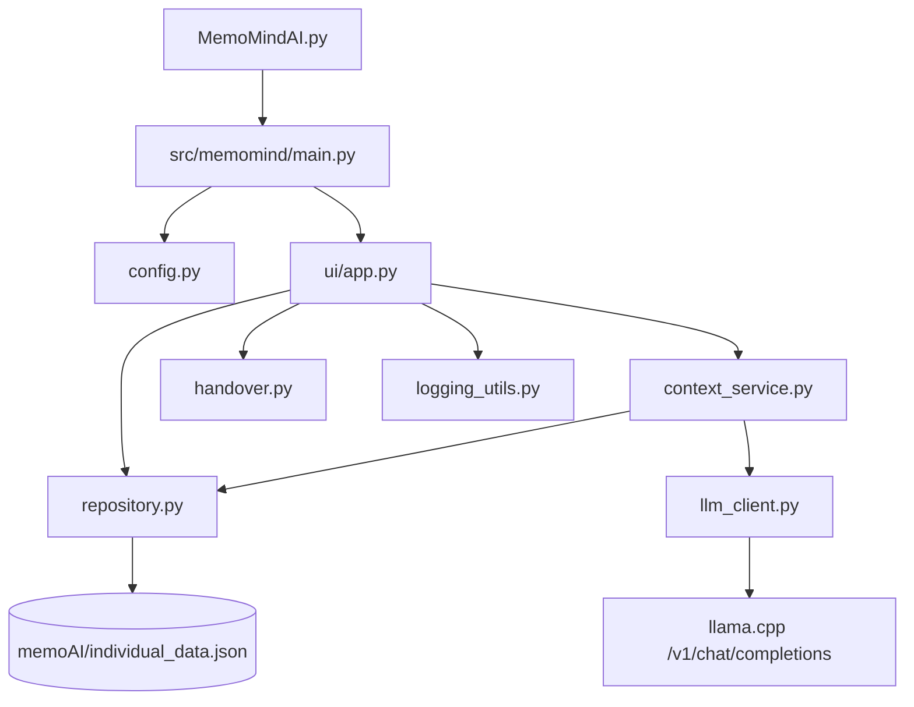

# MemoMindAI 리팩토링 구조

## 파일 구조

```text
MemoMindAI/
├── MemoMindAI.py                 # 기존 실행 명령을 보존하는 진입점
├── src/
│   └── memomind/
│       ├── __init__.py           # 패키지 정보
│       ├── main.py               # Flet 실행 구성
│       ├── config.py             # 환경변수와 실행/데이터/에셋 경로
│       ├── repository.py         # TinyDB 생성 및 메모 CRUD
│       ├── llm_client.py         # llama.cpp HTTP 요청과 SSE 파싱
│       ├── context_service.py    # 질문 유형 분류와 검색 컨텍스트 생성
│       ├── handover.py           # JSON 추출·저장·수신 데이터 정규화
│       ├── logging_utils.py      # 채팅 단계 로그
│       └── ui/
│           ├── __init__.py
│           └── app.py            # Flet 화면, 다이얼로그와 이벤트 연결
```

## 의존 방향



UI는 사용자 상호작용과 화면 갱신을 담당합니다. 데이터 형식, 저장 방식, LLM 응답 형식은 각각의 하위 모듈이 감싸므로 이후 저장소나 모델 서버를 교체할 때 UI 변경 범위를 줄일 수 있습니다.

## 유지보수 원칙

- 환경변수나 실행 경로는 `config.py`에서만 해석합니다.
- TinyDB 호출은 `repository.py`의 메서드를 통해 수행합니다.
- llama.cpp의 JSON/SSE 형식 변화는 `llm_client.py`에서 흡수합니다.
- 질문 분류 기준이나 컨텍스트 조합은 `context_service.py`에서 변경합니다.
- JSON 인수인계 스키마 변경은 `handover.py`와 해당 테스트를 함께 수정합니다.
- Flet 위젯 배치와 이벤트만 `ui/app.py`에 둡니다.

## 검증

프로젝트 가상환경에서 다음 명령으로 핵심 로직 회귀 테스트를 실행합니다.

```bash
.venv/bin/python -m unittest discover -s tests -v
```
